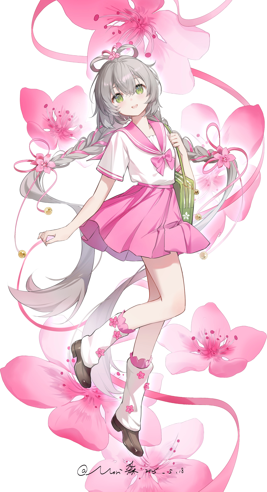

    <picture>
        <source media="(max-width: 767px)" srcset="./assets/130549453/130549453_p0.webp" width="100%">
        
    </picture>
        <picture>
        <source media="(max-width: 767px)" srcset="./github-metrics.svg" width="100%">
        
    </picture>

<h1 align="center">👋Hi , I'm SakuraPuare
<h3 align="center">Code the Feeling🌼, Record the Life🏞️</h3>

- 🔭 I’m currently working on **Desktop App Develop**
- 🌱 I’m currently learning **🪄Deep Learning 🛡️Frontend**
- 🤝 I’m looking for help with **📄Paper Writing**
- 📝 I regularly write articles on [ShuYingJiYu](https://blog.sakurapuare.com)
- 💬 Ask me about **Anything if you like**
- 📫 How to reach me **<sakurapuare@sakurapuare.com>**

    <picture>
        <source media="(prefers-color-scheme: dark)" srcset="https://github-readme-stats.vercel.app/api?username=sakurapuare&theme=dracula&rank_icon=percentile&show_icons=true&show=prs_merged,reviews,prs_merged_percentage">
        <source media="(prefers-color-scheme: light)" srcset="https://github-readme-stats.vercel.app/api?username=sakurapuare&theme=default&rank_icon=percentile&show_icons=true&show=prs_merged,reviews,prs_merged_percentage">
        
    </picture>

