    <picture>
        <source media="(max-width: 767px)" srcset="./github-metrics.svg" width="100%">
        
    </picture>
    <picture>
        <source media="(max-width: 767px)" srcset="./assets/00000-minimized.webp" width="100%">
        
    </picture>

<h1 align="center">👋Hi , I'm SakuraPuare
<h3 align="center">Code the Feeling🌼, Record the Life🏞️</h3>

- 🔭 I’m currently working on **Desktop App Develop**
- 🌱 I’m currently learning **🪄Deep Learning 🛡️Frontend**
- 🤝 I’m looking for help with **📄Paper Writing**
- 📝 I regularly write articles on [ShuYingJiYu](https://blog.sakurapuare.com)
- 💬 Ask me about **Anything if you like**
- 📫 How to reach me **<sakurapuare@sakurapuare.com>**

    